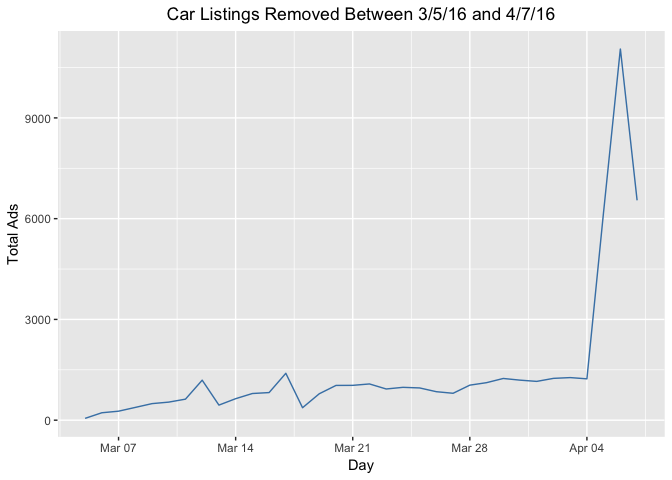

## Introduction
This project examines 50,000 used car/ used car sales data points from the classifieds section of the German eBay website.  The data originates from Kaggle but has been dirtied by Dataquest for purposes of data cleaning.  A few of the dataset variables include:

* ```name```: the name of the car

* ```dateCreated```: the date the eBay listing was created

* ```nrOfPictures```: the number of pictures in the ad

* ```kilometer```: how many kilometers the car has driven

Here's sampling of the first few rows.


```r
setwd("/Users/roberthazell/Desktop/Dataquest/Germany-Ebay-Car-Analysis")
autos <- read.csv("autos.csv")
# use auto_info to preserve original dataset auto_info
auto_info = autos
head(auto_info)
```

```
          dateCrawled
1 2016-03-26 17:47:46
2 2016-04-04 13:38:56
3 2016-03-26 18:57:24
4 2016-03-12 16:58:10
5 2016-04-01 14:38:50
6 2016-03-21 13:47:45
                                                                  name
1                                     Peugeot_807_160_NAVTECH_ON_BOARD
2                           BMW_740i_4_4_Liter_HAMANN_UMBAU_Mega_Optik
3                                           Volkswagen_Golf_1.6_United
4                  Smart_smart_fortwo_coupe_softouch/F1/Klima/Panorama
5   Ford_Focus_1_6_Benzin_T\xdcV_neu_ist_sehr_gepflegt.mit_Klimaanlage
6 Chrysler_Grand_Voyager_2.8_CRD_Aut.Limited_Stow\xb4n_Go_Sitze_7Sitze
  seller offerType  price  abtest vehicleType yearOfRegistration   gearbox
1 privat   Angebot $5,000 control         bus               2004   manuell
2 privat   Angebot $8,500 control   limousine               1997 automatik
3 privat   Angebot $8,990    test   limousine               2009   manuell
4 privat   Angebot $4,350 control  kleinwagen               2007 automatik
5 privat   Angebot $1,350    test       kombi               2003   manuell
6 privat   Angebot $7,900    test         bus               2006 automatik
  powerPS   model  odometer monthOfRegistration fuelType      brand
1     158  andere 150,000km                   3      lpg    peugeot
2     286     7er 150,000km                   6   benzin        bmw
3     102    golf  70,000km                   7   benzin volkswagen
4      71  fortwo  70,000km                   6   benzin      smart
5       0   focus 150,000km                   7   benzin       ford
6     150 voyager 150,000km                   4   diesel   chrysler
  notRepairedDamage         dateCreated nrOfPictures postalCode
1              nein 2016-03-26 00:00:00            0      79588
2              nein 2016-04-04 00:00:00            0      71034
3              nein 2016-03-26 00:00:00            0      35394
4              nein 2016-03-12 00:00:00            0      33729
5              nein 2016-04-01 00:00:00            0      39218
6                   2016-03-21 00:00:00            0      22962
             lastSeen
1 2016-04-06 06:45:54
2 2016-04-06 14:45:08
3 2016-04-06 20:15:37
4 2016-03-15 03:16:28
5 2016-04-01 14:38:50
6 2016-04-06 09:45:21
```
## Initial Data Exploration

Taking a look at the structure:


```r
str(auto_info)
```

```
'data.frame':	50000 obs. of  20 variables:
 $ dateCrawled        : Factor w/ 48213 levels "2016-03-05 14:06:30",..: 31827 46100 32003 10998 41030 23551 22326 16857 25659 16302 ...
 $ name               : Factor w/ 38754 levels "_____AUDI_A4_S_LINE______VOLLAUSSTATUNG______",..: 25148 6680 33159 29684 11180 8169 36697 13878 27945 26854 ...
 $ seller             : Factor w/ 2 levels "gewerblich","privat": 2 2 2 2 2 2 2 2 2 2 ...
 $ offerType          : Factor w/ 2 levels "Angebot","Gesuch": 1 1 1 1 1 1 1 1 1 1 ...
 $ price              : Factor w/ 2357 levels "$0","$1","$1,000",..: 1728 2181 2215 1561 58 2093 1367 174 1096 1868 ...
 $ abtest             : Factor w/ 2 levels "control","test": 1 1 2 1 2 2 2 1 2 1 ...
 $ vehicleType        : Factor w/ 9 levels "","andere","bus",..: 3 8 8 6 7 3 8 8 1 3 ...
 $ yearOfRegistration : int  2004 1997 2009 2007 2003 2006 1995 1998 2000 1997 ...
 $ gearbox            : Factor w/ 3 levels "","automatik",..: 3 2 3 2 3 2 3 3 3 3 ...
 $ powerPS            : int  158 286 102 71 0 150 90 90 0 90 ...
 $ model              : Factor w/ 246 levels "","1_reihe","100",..: 42 21 118 108 105 236 118 118 44 151 ...
 $ odometer           : Factor w/ 13 levels "10,000km","100,000km",..: 4 4 11 11 4 4 4 4 4 4 ...
 $ monthOfRegistration: int  3 6 7 6 7 4 8 12 10 7 ...
 $ fuelType           : Factor w/ 8 levels "","andere","benzin",..: 8 3 3 3 3 5 3 5 1 3 ...
 $ brand              : Factor w/ 40 levels "alfa_romeo","audi",..: 26 3 39 33 11 5 39 39 31 28 ...
 $ notRepairedDamage  : Factor w/ 3 levels "","ja","nein": 3 3 3 3 3 1 1 3 3 3 ...
 $ dateCreated        : Factor w/ 76 levels "2015-06-11 00:00:00",..: 64 73 64 50 70 59 58 54 60 54 ...
 $ nrOfPictures       : int  0 0 0 0 0 0 0 0 0 0 ...
 $ postalCode         : int  79588 71034 35394 33729 39218 22962 31535 53474 7426 15749 ...
 $ lastSeen           : Factor w/ 39481 levels "2016-03-05 14:45:46",..: 31336 33321 34787 4785 21264 32059 11890 36750 15249 32371 ...
```
Many of these variables are factor variables though they don't need to.  Such variables include ```lastSeen```, ```dateCreated```, ```price```, and ```odometer```.

We can check if there are ```NA```s, too.  Thankfully none of the variables are null.


```r
sapply(auto_info,  function(x) sum(is.na(x)))
```

```
        dateCrawled                name              seller 
                  0                   0                   0 
          offerType               price              abtest 
                  0                   0                   0 
        vehicleType  yearOfRegistration             gearbox 
                  0                   0                   0 
            powerPS               model            odometer 
                  0                   0                   0 
monthOfRegistration            fuelType               brand 
                  0                   0                   0 
  notRepairedDamage         dateCreated        nrOfPictures 
                  0                   0                   0 
         postalCode            lastSeen 
                  0                   0 
```

We can get a five-number summary of this data.


```r
summary(auto_info)
```

```
              dateCrawled                     name      
 2016-03-05 16:57:05:    3   Ford_Fiesta        :   78  
 2016-03-08 10:40:35:    3   BMW_316i           :   75  
 2016-03-09 11:54:38:    3   Volkswagen_Golf_1.4:   75  
 2016-03-10 15:36:24:    3   BMW_318i           :   72  
 2016-03-11 22:38:16:    3   Volkswagen_Polo    :   72  
 2016-03-12 16:06:22:    3   BMW_320i           :   71  
 (Other)            :49982   (Other)            :49557  
        seller        offerType         price           abtest     
 gewerblich:    1   Angebot:49999   $0     : 1421   control:24244  
 privat    :49999   Gesuch :    1   $500   :  781   test   :25756  
                                    $1,500 :  734                  
                                    $2,500 :  643                  
                                    $1,000 :  639                  
                                    $1,200 :  639                  
                                    (Other):45143                  
     vehicleType    yearOfRegistration      gearbox         powerPS       
 limousine :12859   Min.   :1000                : 2680   Min.   :    0.0  
 kleinwagen:10822   1st Qu.:1999       automatik:10327   1st Qu.:   70.0  
 kombi     : 9127   Median :2003       manuell  :36993   Median :  105.0  
           : 5095   Mean   :2005                         Mean   :  116.4  
 bus       : 4093   3rd Qu.:2008                         3rd Qu.:  150.0  
 cabrio    : 3061   Max.   :9999                         Max.   :17700.0  
 (Other)   : 4943                                                         
     model            odometer     monthOfRegistration    fuelType    
 golf   : 4024   150,000km:32424   Min.   : 0.000      benzin :30107  
 andere : 3528   125,000km: 5170   1st Qu.: 3.000      diesel :14567  
 3er    : 2761   100,000km: 2169   Median : 6.000             : 4482  
        : 2758   90,000km : 1757   Mean   : 5.723      lpg    :  691  
 polo   : 1757   80,000km : 1436   3rd Qu.: 9.000      cng    :   75  
 corsa  : 1735   70,000km : 1230   Max.   :12.000      hybrid :   37  
 (Other):33437   (Other)  : 5814                       (Other):   41  
           brand       notRepairedDamage              dateCreated   
 volkswagen   :10687       : 9829        2016-04-03 00:00:00: 1946  
 opel         : 5461   ja  : 4939        2016-03-20 00:00:00: 1893  
 bmw          : 5429   nein:35232        2016-03-21 00:00:00: 1886  
 mercedes_benz: 4734                     2016-04-04 00:00:00: 1844  
 audi         : 4283                     2016-03-12 00:00:00: 1831  
 ford         : 3479                     2016-03-14 00:00:00: 1761  
 (Other)      :15927                     (Other)            :38839  
  nrOfPictures   postalCode                   lastSeen    
 Min.   :0     Min.   : 1067   2016-04-07 06:17:27:    8  
 1st Qu.:0     1st Qu.:30451   2016-04-06 06:17:24:    7  
 Median :0     Median :49577   2016-04-06 21:17:51:    7  
 Mean   :0     Mean   :50814   2016-04-07 03:16:17:    7  
 3rd Qu.:0     3rd Qu.:71540   2016-04-05 16:44:47:    6  
 Max.   :0     Max.   :99998   2016-04-06 01:16:01:    6  
                               (Other)            :49959  
```

Taking a brief look, the number of pictures (```nrOfPictures```) is completely zero, so this column can be removed.


```r
# get the column number of that variable
pictures_col <- grep("Pictures", colnames(auto_info))
# remove the column
auto_info <- auto_info[, -pictures_col]
```

## Cleaning the data structure

Earlier it was mentioned some of the variables have improper datatypes.  Some of these variables, like ```price``` and ```odometer``` have extra characters ($ and km).  Even if no analysis is to be done on them, it's still helpful to reformat them anyway just in case.

Here's a rundown of what to transform each variable's datatype in to.


```r
var_transform <- data.frame(
  'Variable Name' = c('dateCrawled', 'name', 
                      'price', 'model', 'odometer', 
                      'brand', 'dateCreated', 'lastSeen'),
                            
  'Convert To' = c('Date', 'String', 'Numeric', 
                   'String', 'Integer', 'String', 'Date', 'Date'))

var_transform %>% 
  `colnames<-`(c('Variable Name', 'Convert To')) %>% 
  kable(align = rep('c',2)) %>% 
  kable_styling(bootstrap_options = "striped", full_width = F)
```

<table class="table table-striped" style="width: auto !important; margin-left: auto; margin-right: auto;">
 <thead>
  <tr>
   <th style="text-align:center;"> Variable Name </th>
   <th style="text-align:center;"> Convert To </th>
  </tr>
 </thead>
<tbody>
  <tr>
   <td style="text-align:center;"> dateCrawled </td>
   <td style="text-align:center;"> Date </td>
  </tr>
  <tr>
   <td style="text-align:center;"> name </td>
   <td style="text-align:center;"> String </td>
  </tr>
  <tr>
   <td style="text-align:center;"> price </td>
   <td style="text-align:center;"> Numeric </td>
  </tr>
  <tr>
   <td style="text-align:center;"> model </td>
   <td style="text-align:center;"> String </td>
  </tr>
  <tr>
   <td style="text-align:center;"> odometer </td>
   <td style="text-align:center;"> Integer </td>
  </tr>
  <tr>
   <td style="text-align:center;"> brand </td>
   <td style="text-align:center;"> String </td>
  </tr>
  <tr>
   <td style="text-align:center;"> dateCreated </td>
   <td style="text-align:center;"> Date </td>
  </tr>
  <tr>
   <td style="text-align:center;"> lastSeen </td>
   <td style="text-align:center;"> Date </td>
  </tr>
</tbody>
</table>

Let's do that now in the order of the table above.


```r
auto_info$dateCrawled <- ymd_hms(auto_info$dateCrawled) %>% date()
auto_info$name <- as.character(auto_info$name)
# remove "$" and any commas from the price column 
auto_info$price %<>% as.character() %>% gsub(",", "", .) %>% 
  sub("\\$", "", .) %>% as.numeric()
auto_info$model <- as.character(auto_info$model)
# remove "km" and "," and make values numeric in the odometer column
auto_info$odometer %<>% as.character() %>% sub("km","", .) %>% 
  sub(",","", .) %>% as.numeric()
auto_info$brand <- as.character(auto_info$brand)
auto_info$dateCreated <- ymd_hms(auto_info$dateCreated) %>% date()
auto_info$lastSeen <- ymd_hms(auto_info$lastSeen) %>% date()
```

## Exploring Odometer and Price

We'll examine ```odometer``` and ```price``` for any patterns, beginning with ```odometer```.


```r
auto_info %>% 
  group_by(`Odometer Value (km)` = odometer) %>% 
  summarise(Total = length(`Odometer Value (km)`)) %>% 
  arrange(desc(`Odometer Value (km)`)) %>% 
  kable(align = rep('c',2)) %>% 
  kable_styling(bootstrap_options = "striped", full_width = F)
```

<table class="table table-striped" style="width: auto !important; margin-left: auto; margin-right: auto;">
 <thead>
  <tr>
   <th style="text-align:center;"> Odometer Value (km) </th>
   <th style="text-align:center;"> Total </th>
  </tr>
 </thead>
<tbody>
  <tr>
   <td style="text-align:center;"> 150000 </td>
   <td style="text-align:center;"> 32424 </td>
  </tr>
  <tr>
   <td style="text-align:center;"> 125000 </td>
   <td style="text-align:center;"> 5170 </td>
  </tr>
  <tr>
   <td style="text-align:center;"> 100000 </td>
   <td style="text-align:center;"> 2169 </td>
  </tr>
  <tr>
   <td style="text-align:center;"> 90000 </td>
   <td style="text-align:center;"> 1757 </td>
  </tr>
  <tr>
   <td style="text-align:center;"> 80000 </td>
   <td style="text-align:center;"> 1436 </td>
  </tr>
  <tr>
   <td style="text-align:center;"> 70000 </td>
   <td style="text-align:center;"> 1230 </td>
  </tr>
  <tr>
   <td style="text-align:center;"> 60000 </td>
   <td style="text-align:center;"> 1164 </td>
  </tr>
  <tr>
   <td style="text-align:center;"> 50000 </td>
   <td style="text-align:center;"> 1027 </td>
  </tr>
  <tr>
   <td style="text-align:center;"> 40000 </td>
   <td style="text-align:center;"> 819 </td>
  </tr>
  <tr>
   <td style="text-align:center;"> 30000 </td>
   <td style="text-align:center;"> 789 </td>
  </tr>
  <tr>
   <td style="text-align:center;"> 20000 </td>
   <td style="text-align:center;"> 784 </td>
  </tr>
  <tr>
   <td style="text-align:center;"> 10000 </td>
   <td style="text-align:center;"> 264 </td>
  </tr>
  <tr>
   <td style="text-align:center;"> 5000 </td>
   <td style="text-align:center;"> 967 </td>
  </tr>
</tbody>
</table>

Clearly, the majority of used cars have traveled farther.  

Let's look at price.


```r
price_summary <- auto_info %>% select(price) %>% 
  group_by(`Price($)`= price) %>% 
  summarise(`Total Cars` = length(`Price($)`)) 

price_summary %>% arrange(`Price($)`) %>% head() %>% 
  kable(align = rep('c',2)) %>% 
  kable_styling(bootstrap_options = "striped", full_width = F)
```

<table class="table table-striped" style="width: auto !important; margin-left: auto; margin-right: auto;">
 <thead>
  <tr>
   <th style="text-align:center;"> Price($) </th>
   <th style="text-align:center;"> Total Cars </th>
  </tr>
 </thead>
<tbody>
  <tr>
   <td style="text-align:center;"> 0 </td>
   <td style="text-align:center;"> 1421 </td>
  </tr>
  <tr>
   <td style="text-align:center;"> 1 </td>
   <td style="text-align:center;"> 156 </td>
  </tr>
  <tr>
   <td style="text-align:center;"> 2 </td>
   <td style="text-align:center;"> 3 </td>
  </tr>
  <tr>
   <td style="text-align:center;"> 3 </td>
   <td style="text-align:center;"> 1 </td>
  </tr>
  <tr>
   <td style="text-align:center;"> 5 </td>
   <td style="text-align:center;"> 2 </td>
  </tr>
  <tr>
   <td style="text-align:center;"> 8 </td>
   <td style="text-align:center;"> 1 </td>
  </tr>
</tbody>
</table>

```r
price_summary %>% arrange(desc(`Price($)`)) %>% 
  head() %>% kable(align = rep('c',2)) %>% 
  kable_styling(bootstrap_options = "striped", full_width = F)
```

<table class="table table-striped" style="width: auto !important; margin-left: auto; margin-right: auto;">
 <thead>
  <tr>
   <th style="text-align:center;"> Price($) </th>
   <th style="text-align:center;"> Total Cars </th>
  </tr>
 </thead>
<tbody>
  <tr>
   <td style="text-align:center;"> 99999999 </td>
   <td style="text-align:center;"> 1 </td>
  </tr>
  <tr>
   <td style="text-align:center;"> 27322222 </td>
   <td style="text-align:center;"> 1 </td>
  </tr>
  <tr>
   <td style="text-align:center;"> 12345678 </td>
   <td style="text-align:center;"> 3 </td>
  </tr>
  <tr>
   <td style="text-align:center;"> 11111111 </td>
   <td style="text-align:center;"> 2 </td>
  </tr>
  <tr>
   <td style="text-align:center;"> 10000000 </td>
   <td style="text-align:center;"> 1 </td>
  </tr>
  <tr>
   <td style="text-align:center;"> 3890000 </td>
   <td style="text-align:center;"> 1 </td>
  </tr>
</tbody>
</table>

Amazingly, some cars are listed as \$0, though that represents only 2% of the cars.  The most expensive car is \$99,999,999! 

## Exploring Ad Dates

The ```lastSeen``` column  records the date the web crawler last saw any listing, which allows us to determine on what day a listing was removed, presumably because the car was sold.  Let's take a look and see if any patterns emerge.


```r
ad_timeline <- auto_info %>% 
  group_by(`Last Seen` = lastSeen) %>% 
  summarise(Total = length(`Last Seen`))

ad_timeline %>% head() %>% 
  kable(align = rep('c',2)) %>% 
  kable_styling(bootstrap_options = "striped", full_width = F)
```

<table class="table table-striped" style="width: auto !important; margin-left: auto; margin-right: auto;">
 <thead>
  <tr>
   <th style="text-align:center;"> Last Seen </th>
   <th style="text-align:center;"> Total </th>
  </tr>
 </thead>
<tbody>
  <tr>
   <td style="text-align:center;"> 2016-03-05 </td>
   <td style="text-align:center;"> 54 </td>
  </tr>
  <tr>
   <td style="text-align:center;"> 2016-03-06 </td>
   <td style="text-align:center;"> 221 </td>
  </tr>
  <tr>
   <td style="text-align:center;"> 2016-03-07 </td>
   <td style="text-align:center;"> 268 </td>
  </tr>
  <tr>
   <td style="text-align:center;"> 2016-03-08 </td>
   <td style="text-align:center;"> 380 </td>
  </tr>
  <tr>
   <td style="text-align:center;"> 2016-03-09 </td>
   <td style="text-align:center;"> 493 </td>
  </tr>
  <tr>
   <td style="text-align:center;"> 2016-03-10 </td>
   <td style="text-align:center;"> 538 </td>
  </tr>
</tbody>
</table>

Better to make a time series plot.


```r
ggplot(ad_timeline) + 
  geom_line(aes(`Last Seen`, Total), col = 'steel blue') + 
  xlab("Day") + ylab("Total Ads") + 
  ggtitle("Car Listings Removed Between 3/5/16 and 4/7/16") + 
  theme(plot.title = element_text(hjust = 0.5))
```

<!-- -->

The number of car listings taken down is roughly uniform until April 4 (the last three days of the dataset).  It's unclear what's behind this behavior but further research can be done to determine the cause of (an apparent) buying frenzy.

## Fixing Incorrect Registration Year Data

Looking back at the ```summary(auto_info)``` output, you'll see the minimum value for the ```yearOfRegistration``` column is ```1000``` and the maximum value is ```9999```, obviously incorrect data.


```r
summary(auto_info$yearOfRegistration)
```

```
   Min. 1st Qu.  Median    Mean 3rd Qu.    Max. 
   1000    1999    2003    2005    2008    9999 
```

Furthermore, there is mismatch between the year an eBay ad was posted and the year a car was first registered.  In other words, it's not possible for a car to be first registered after the listing was first seen.  However, this anomaly exists.


```r
# find latest year for car registration
auto_info %>% select(yearOfRegistration) %>% 
  filter(yearOfRegistration < 2020) %>% 
  arrange(desc(yearOfRegistration)) %>% 
  head(1)
```

```
  yearOfRegistration
1               2019
```

```r
# find latest year a car listing was made
year(auto_info$dateCreated) %>% max()
```

```
[1] 2016
```

So the latest listing is from 2016 but the latest car registration year is 2019.  For simplicity we'll assume the earliest valid registration is somewhere in the early 20th century.  We can count the number cars with registration outside 1900-2016 and see if those rows can safely be removed, or if more custom logic is needed.


```r
auto_info %>% 
  filter(!between(yearOfRegistration, 1900, 2016)) %>% 
  nrow()/nrow(auto_info)
```

```
[1] 0.03944
```

Car registrations outside the 1900-2016 range account for less than 4% of the complete dataset, so these can be safely removed.


```r
auto_info %<>% filter(between(yearOfRegistration, 1900, 2016)) 
```

## Exploring Price by Brand

Let's first look at the number of car listings by brand.


```r
top_listings <- auto_info %>% 
  select(brand) %>% group_by(Brand = brand) %>% 
  summarise(Total = length(Brand)) %>% 
  arrange(desc(Total))

top_listings
```

```
# A tibble: 40 x 2
   Brand         Total
   <chr>         <int>
 1 volkswagen    10188
 2 bmw            5284
 3 opel           5195
 4 mercedes_benz  4580
 5 audi           4149
 6 ford           3352
 7 renault        2274
 8 peugeot        1418
 9 fiat           1242
10 seat            873
# … with 30 more rows
```

As one might guess (though it need not be the true), the highest proportion of cars are German in origin, representing four out of the top 5 brands.  The price analysis will focus on the top five brands.


```r
top_five_listings = head(top_listings$Brand, 5)

auto_info %>% 
  filter(brand %in% top_five_listings) %>% 
  group_by(Brand = brand) %>% 
  summarise(`Mean Price` = mean(price))
```

```
# A tibble: 5 x 2
  Brand         `Mean Price`
  <chr>                <dbl>
1 audi                 9094.
2 bmw                  8335.
3 mercedes_benz       30317.
4 opel                 5253.
5 volkswagen           6516.
```

Mercedes has the highest mean price, but is there an outlier?  Yes.  


```r
top_n(auto_info, 1, auto_info$price) %>% select(price, brand)
```

```
  price         brand
1 1e+08 mercedes_benz
```

The highest priced car (at \$99,999,999) belongs to this brand.  So why is ```1e08``` (\$100,000,000) shown?  This is the well known problem of precision in computer science.  Just to prove I'm not bluffing, take a look at this:


```r
x = 99999999
x
```

```
[1] 1e+08
```

It's outside the scope of this report but you can find more info (if not familiar already with the subject) beginning [here](https://stackoverflow.com/questions/9508518/why-are-these-numbers-not-equal). 

If we remove this row, let's see how the mean prices change.


```r
# remove outlier
auto_info <- auto_info[-which(auto_info$price == max(auto_info$price)), ]
# find mean prices
auto_info %>% filter(brand %in% top_five_listings) %>% 
  group_by(Brand = brand) %>% 
  summarise(`Mean Price` = mean(price))
```

```
# A tibble: 5 x 2
  Brand         `Mean Price`
  <chr>                <dbl>
1 audi                 9094.
2 bmw                  8335.
3 mercedes_benz        8485.
4 opel                 5253.
5 volkswagen           6516.
```

Now it's Audi that features the highest mean price.

## Exploring Mileage

The final variable of exploration is mileage.  Which brands have higher mileage listed, and does this correlate with price?


```r
auto_info %>% filter(brand %in% top_five_listings) %>% 
  group_by(Brand = brand) %>% 
  select(Brand, price, odometer) %>%
  summarise(`Mean Price` = mean(price), `Mean Mileage` = mean(odometer)) %>%
  arrange(desc(`Mean Mileage`))
```

```
# A tibble: 5 x 3
  Brand         `Mean Price` `Mean Mileage`
  <chr>                <dbl>          <dbl>
1 bmw                  8335.        132435.
2 mercedes_benz        8485.        130856.
3 audi                 9094.        129288.
4 opel                 5253.        129227.
5 volkswagen           6516.        128730.
```

There isn't much variability in mean mileage, but cars with higher mileage tend to be more expensive.  

## Conclusion

This project explores used car data from Germany's eBay website.  The analysis covered questions regarding:

* data structure

* most popular brands

* outliers

* price

* mileage

* car listing dates
